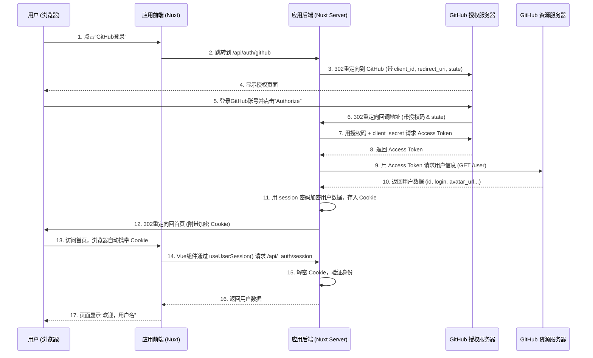

## 📚 系列导航

本系列共两篇：

1. [**Nuxt 4 集成 Drizzle ORM (PostgreSQL)**](./nuxt-drizzle-postgresql) —— 数据层：Schema 定义、迁移与查询
2. [**Nuxt 4 集成 GitHub 登录**](./nuxt-oauth-github) —— 认证层：OAuth 原理与开发/生产配置

---

本文详细讲解在 Nuxt 4 应用中集成 GitHub OAuth 登录的完整过程，涵盖 OAuth 2.0 核心原理、nuxt-auth-utils 模块的工作机制、**开发环境与生产环境的差异化配置**、从零到一的实现步骤，以及**生产环境部署时容易踩的坑和解决方案**。

> 适用版本

- Nuxt 4

- nuxt-auth-utils v0.4

- Node: v20+

---

## 一、OAuth 2.0 核心原理（为什么第三方登录能“认识”用户）

### 1.1 四个角色

OAuth 流程涉及四个参与者：

| 角色           | 技术名词             | 说明                                               |
| -------------- | -------------------- | -------------------------------------------------- |
| **资源所有者** | Resource Owner       | 拥有 GitHub 账号的用户                             |
| **客户端应用** | Client               | 需要访问用户 GitHub 信息的应用（即你的 Nuxt 应用） |
| **授权服务器** | Authorization Server | GitHub 的身份验证与授权端点                        |
| **资源服务器** | Resource Server      | GitHub 的 API 服务器，存储用户数据                 |

在 GitHub 的实现中，授权服务器与资源服务器属同一实体，但逻辑职责分离。

### 1.2 授权码模式核心流程

OAuth 2.0 授权码模式是最安全的流程，核心思想是：客户端应用**绝不接触用户密码**，而是通过一次性的授权码换取代表用户身份的访问令牌。

1. **引导用户**：应用将用户重定向到 GitHub 授权页，附带 `client_id`、`redirect_uri` 和 `state`。
2. **用户授权**：用户在 GitHub 登录并确认授权。
3. **返回授权码**：GitHub 将用户重定向回应用的回调地址，并在 URL 中附带授权码。
4. **换取令牌**：应用后端使用 `client_id` + `client_secret` + 授权码向 GitHub 换取 `access_token`。
5. **获取用户信息**：后端使用 `access_token` 调用 GitHub API 获取用户数据。

### 1.3 关键概念

- **client_id**：应用的公开标识，用于识别应用。
- **client_secret**：应用的私密密钥，用于后端安全通信，**严禁暴露**。
- **redirect_uri**：授权成功后 GitHub 重定向的地址，必须与注册时完全一致。
- **scope**：权限范围，指定应用可访问的用户信息（如公开资料、邮箱等）。
- **state**：防 CSRF 的随机字符串，在请求和回调中保持一致。

---

## 二、GitHub OAuth 完整交互时序



### 各步骤原理

- **步骤 2**：`/api/auth/github` 由 `nuxt-auth-utils` 提供，构造 GitHub 授权 URL 并返回 302 重定向。
- **步骤 3**：重定向 URL 包含 `client_id`、`redirect_uri` 和自动生成的 `state`。
- **步骤 6**：回调中携带授权码和 `state`，后端验证 `state` 一致性。
- **步骤 7**：后端通过 `client_secret` 换取 `access_token`，该步骤在服务器间进行，密钥不暴露。
- **步骤 11**：使用 `NUXT_SESSION_PASSWORD` 加密用户数据，存入 `HttpOnly` 的 `nuxt-session` Cookie。
- **步骤 14**：`useUserSession()` 实际调用 `/api/_auth/session`，后端解密 Cookie 返回用户信息。

---

## 三、nuxt-auth-utils 工作原理

### 3.1 Session 存储：加密 Cookie

- 调用 `setUserSession(event, data)` 时，模块利用 `NUXT_SESSION_PASSWORD` 对数据进行加密，生成 `nuxt-session` Cookie。
- Cookie 属性：`HttpOnly`（防 XSS）、`SameSite=Lax`（防 CSRF）、`Secure`（生产环境强制 HTTPS）。
- 后续请求自动携带该 Cookie，后端通过 `getUserSession(event)` 解密还原数据。

**优点**：无需数据库，适合 Serverless 部署；数据加密防篡改。  
**缺点**：Cookie 大小限制 4KB；无法主动全局使所有 session 失效。

### 3.2 前端 useUserSession

- 组件挂载时自动调用 `/api/_auth/session` 获取当前用户数据。
- 返回 `loggedIn`（计算属性，等价于 `!!user.value`）和 `user`（响应式数据）。
- 登录状态变化时自动更新。

### 3.3 为何区分 `loggedIn` 和 `user`

- 模板中可直接用 `v-if="loggedIn"` 表达登录状态，避免手动判断 `user` 是否为空。

---

## 四、开发环境配置（本地运行）

### 4.1 安装 nuxt-auth-utils 模块

```bash
npx nuxi@latest module add auth-utils
```

### 4.2 环境变量配置：使用 `.env.example` 模板

1. 在项目根目录创建 `.env.example` 文件，并**提交到代码仓库**：

   ```bash
   # 至少 32 位随机字符串（本地开发用）
   NUXT_SESSION_PASSWORD=your-local-32-char-dev-password
   # GitHub OAuth 凭证（需创建独立的 GitHub OAuth App）
   NUXT_OAUTH_GITHUB_CLIENT_ID=your_dev_app_client_id
   NUXT_OAUTH_GITHUB_CLIENT_SECRET=your_dev_app_client_secret
   ```

2. **本地开发时**，复制一份为 `.env` 并填入真实值：

   ```bash
   cp .env.example .env
   ```

   **并将 `.env` 添加到 `.gitignore`**（确保不会误提交）：

   ```bash
   .env
   ```

**原理**：`.env.example` 作为文档，告诉其他开发者需要哪些环境变量；`.env` 包含真实敏感信息，仅存在于本地。

### 4.3 在 GitHub 创建开发环境的 OAuth App

1. 登录 GitHub → **Settings** → **Developer settings** → **OAuth Apps** → **New OAuth App**。
2. 填写：
   - **Application name**：例如 `myapp-dev`（明确标识为开发环境）
   - **Homepage URL**：`http://localhost:3000`
   - **Authorization callback URL**：`http://localhost:3000/api/auth/github`

3. 注册后复制 **Client ID** 和 **Client Secret** 填入 `.env` 文件。

### 4.4 配置 nuxt.config.ts

```ts
export default defineNuxtConfig({
  modules: ["nuxt-auth-utils"],
  runtimeConfig: {
    oauth: {
      github: {
        clientId: "", // 留空，由环境变量注入
        clientSecret: "",
      },
    },
  },
})
```

**原理**：`runtimeConfig` 自动将 `NUXT_OAUTH_GITHUB_*` 注入对应字段，无需硬编码。

### 4.5 ### 创建服务端路由处理回调

创建`server/api/auth/github.get.ts`：

```ts
export default defineOAuthGitHubEventHandler({
  // 使用模块内置的 GitHub OAuth 处理器
  async onSuccess(event, { user }) {
    await setUserSession(event, {
      user: {
        githubId: String(user.id),
        login: user.login,
        name: user.name,
        avatarUrl: user.avatar_url,
        email: user.email, // 注意：可能为 null
      },
      loggedInAt: Date.now(),
    })

    // 重定向回首页（或来源页）
    return sendRedirect(event, "/")
  },
  onError(event, error) {
    console.error("GitHub OAuth error:", error)
    return sendRedirect(event, "/?auth_error=true")
  },
})
```

**注意**：以上代码使用了 `requireNuxtAuthSession`，但实际 `nuxt-auth-utils` 模块的 API 可能略有不同，请以[官方文档](https://github.com/Atinux/nuxt-auth-utils)为准。如果模块提供了专门的 `defineOAuthGitHubEventHandler`，建议直接使用。

**原理**：`defineOAuthGitHubEventHandler` 封装了授权码交换和 token 获取；`setUserSession` 加密数据存入 Cookie。

### 4.6 前端登录按钮

```vue
<script setup>
const { loggedIn, user, clear } = useUserSession()
const loginWithGitHub = () => {
  // 跳转到 GitHub 授权页
  navigateTo("/api/auth/github", { external: true })
}
</script>
<template>
  <div>
    <div v-if="loggedIn">
      
      <span>{{ user.name || user.login }}</span>
      <button @click="clear">登出</button>
    </div>
    <button v-else @click="loginWithGitHub">GitHub 登录</button>
  </div>
</template>
```

**原理**：`useUserSession` 自动获取用户信息；`navigateTo(..., { external: true })` 触发外部重定向；`clear()` 清除 session Cookie。

### 4.7 启动开发服务器

```bash
pnpm dev
```

访问 `http://localhost:3000`，点击登录应能正常跳转到 GitHub 授权页。

## 五、进阶功能：登录后重定向回来源页

### 5.1 问题的由来

默认实现中，登录成功后用户被重定向到首页 /。但更符合用户体验的做法是：用户从哪个页面点击登录，登录后就应该回到哪个页面。例如从 /en/docs/123 点击登录，成功后应回到同一页面。

### 5.2 技术难点：GitHub 回调会丢弃自定义参数

GitHub 在回调时只会保留 code 和 state 两个参数，你附加的任何自定义查询参数（如 ?redirect=/en/docs）都会被丢弃。因此无法通过 URL 参数直接传递来源页。

### 5.3 解决方案：使用 session 存储来源页

#### 5.3.1 创建存储来源页的 API

```ts
// server/api/store-redirect.post.ts
export default defineEventHandler(async (event) => {
  const { redirect } = await readBody(event)

  // 校验 redirect 是否为内部路径（防止开放重定向）
  if (!redirect || typeof redirect !== "string" || !redirect.startsWith("/")) {
    return { ok: false }
  }

  await setUserSession(event, { redirect })
  return { ok: true }
})
```

如果你担心有人恶意传 /\/\/evil.com 这种试图绕过检测的路径，可以加一个更严格的 URL 解析校验：

```ts
import { parseURL } from "ufo"

const { redirect } = await readBody(event)

// 解析路径，确保是内部路径
const parsed = parseURL(redirect)
if (!redirect || !parsed.pathname || parsed.host) {
  return { ok: false }
}
```

> 但说实话，startsWith("/") 对 99.9% 的场景已经足够。这个补充纯属过度设计，不搞也行。

#### 5.3.2 修改前端登录函数

```vue
<script setup>
const { loggedIn } = useUserSession()
const route = useRoute()

const loginWithGitHub = async () => {
  // 将当前完整路径保存到 session
  await $fetch("/api/store-redirect", {
    method: "POST",
    body: { redirect: route.fullPath },
  })
  navigateTo("/api/auth/github", { external: true })
}
</script>
```

#### 5.3.3 修改回调路由以读取来源页

```ts
// server/api/auth/github.get.ts
export default defineOAuthGitHubEventHandler({
  async onSuccess(event, { user }) {
    // 获取之前存储的来源页
    const session = await getUserSession(event)
    let redirect = (session.redirect as string) || "/"

    // 清理 session 中的 redirect（避免下次重复使用）
    await setUserSession(event, { ...session, redirect: undefined })

    // 存入用户信息
    await setUserSession(event, {
      user: {
        githubId: String(user.id),
        login: user.login,
        name: user.name,
        avatarUrl: user.avatar_url,
        email: user.email,
      },
      loggedInAt: Date.now(),
    })

    // 重定向回来源页
    return sendRedirect(event, redirect)
  },

  async onError(event, error) {
    console.error("GitHub OAuth error:", error)
    return sendRedirect(event, "/login?error=true")
  },
})
```

**安全说明**：在 store-redirect.post.ts 中增加了路径校验，防止开放重定向漏洞。

### 5.4 水合问题的处理

当网站支持国际化路径前缀（如 `/zh`、`/en`）时，登录后重定向到来源页还能**自动解决水合不匹配问题**。

#### 5.4.1 水合不匹配的产生原因

1. 用户在 `/en/docs/123` 点击登录
2. 登录成功后，若直接重定向到首页 `/`（无语言前缀）
3. 服务器返回的是默认语言（如中文）的 HTML
4. 但客户端期望的 hydration 内容是英文（用户来源页面是 `/en/...`）
5. 导致水合警告：`Hydration completed but contains mismatches`

#### 5.4.2 为什么重定向到来源页能解决

- 用户从 `/en/docs/123` 来，登录后回到 `/en/docs/123`
- 服务器根据 URL 中的 `/en` 前缀渲染对应的**英文版本**
- 客户端 hydration 时，DOM 结构与 URL 完全匹配
- 水合警告自然消失

---

## 六、生产环境配置（服务器部署）

### 6.1 核心差异：环境变量来源

| 环境     | 配置文件           | 变量来源                        |
| -------- | ------------------ | ------------------------------- |
| 开发环境 | `.env` 文件        | 本地文件（已 gitignore）        |
| 生产环境 | **无** `.env` 文件 | 系统环境变量 / 托管平台 Secrets |

**Nuxt 4 的设计原则**：生产环境不读取 `.env` 文件，所有环境变量必须通过运行环境提供（如 Vercel/Netlify 的环境变量面板、Linux 系统环境变量、Docker 环境变量等）。
**千万不要将 `.env` 文件上传到服务器**，也不要在构建过程中打包进去。

### 6.2 创建生产环境的 GitHub OAuth App

1. 登录 GitHub → 创建**另一个** OAuth App（与开发环境分开）。
2. 填写：
   - **Application name**：例如 `myapp-prod`
   - **Homepage URL**：`https://你的域名`
   - **Authorization callback URL**：`https://你的域名/api/auth/github`

3. 生成并保存 **Client ID** 和 **Client Secret**。

### 6.3 服务器环境变量配置（以 Linux + PM2 为例）

#### 6.3.1 直接设置系统环境变量（临时方案）

```bash
# 编辑 /etc/profile 或 ~/.bashrc，添加：
export NUXT_SESSION_PASSWORD=your-production-32-char-password
export NUXT_OAUTH_GITHUB_CLIENT_ID=your_prod_client_id
export NUXT_OAUTH_GITHUB_CLIENT_SECRET=your_prod_client_secret
# 使环境变量生效
source ~/.bashrc
```

#### 6.3.2 在 PM2 配置文件中引用环境变量（**推荐**）

创建 `ecosystem.config.js`（或通过 CI/CD 自动生成）：

```javascript
module.exports = {
  apps: [
    {
      name: "moongate",
      script: "./server/index.mjs",
      instances: 1,
      exec_mode: "fork",
      env: {
        NODE_ENV: "production",
        NUXT_PUBLIC_SITE_URL: "https://moongate.top",
        PORT: 3000,
        HOST: "0.0.0.0",
        // 引用系统环境变量（更安全）
        NUXT_SESSION_PASSWORD: "your-production-32-char-password",
        NUXT_OAUTH_GITHUB_CLIENT_ID: "your_prod_client_id",
        NUXT_OAUTH_GITHUB_CLIENT_SECRET: "your_prod_client_secret",
      },
    },
  ],
}
```

### 6.4 CI/CD 自动化部署（GitHub Actions 示例）

```yaml
name: Deploy To Production

on:
  push:
    branches: [main]

jobs:
  deploy:
    runs-on: ubuntu-latest
    steps:
      - uses: actions/checkout@v4
      - uses: pnpm/action-setup@v4
      - uses: actions/setup-node@v4
        with:
          node-version: 24
          cache: pnpm

      - name: Install dependencies
        run: pnpm install

      - name: Build
        run: pnpm build

      - name: Deploy via Rsync
        uses: burnett01/rsync-deployments@7.0.1
        with:
          switches: -avz --delete
          path: .output/
          remote_path: /var/www/my-site/
          remote_host: ${{ secrets.SERVER_HOST }}
          remote_user: ${{ secrets.SERVER_USER }}
          remote_key: ${{ secrets.SSH_PRIVATE_KEY }}

      - name: Start service via SSH
        uses: appleboy/ssh-action@v1.0.0
        with:
          host: ${{ secrets.SERVER_HOST }}
          username: ${{ secrets.SERVER_USER }}
          key: ${{ secrets.SSH_PRIVATE_KEY }}
          envs: NUXT_SESSION_PASSWORD, NUXT_OAUTH_GITHUB_CLIENT_ID, NUXT_OAUTH_GITHUB_CLIENT_SECRET
          script: |
            cd /var/www/my-site

            cat > ecosystem.config.js << EOF
            module.exports = {
              apps: [{
                name: "moongate",
                script: "./server/index.mjs",
                instances: 1,
                exec_mode: "fork",
                env: {
                  NODE_ENV: "production",
                  NUXT_PUBLIC_SITE_URL: "https://moongate.top",
                  PORT: 3000,
                  HOST: "0.0.0.0",
                  NUXT_SESSION_PASSWORD: "$(echo -n "$NUXT_SESSION_PASSWORD")",
                  NUXT_OAUTH_GITHUB_CLIENT_ID: "$(echo -n "$NUXT_OAUTH_GITHUB_CLIENT_ID")",
                  NUXT_OAUTH_GITHUB_CLIENT_SECRET: "$(echo -n "$NUXT_OAUTH_GITHUB_CLIENT_SECRET")"
                }
              }]
            }
            EOF

            pm2 restart ecosystem.config.js --update-env
```

**关键点**：使用 `echo -n` 去除换行符，避免密码末尾被污染导致加密不匹配。

### 6.5 验证生产环境

- 访问 `https://你的域名.com/api/_auth/session`，应返回 `{"user":null}` 或登录后的用户信息。
- 点击登录按钮，应能跳转到 GitHub 授权页，授权后返回首页并显示用户信息。

---

## 七、生产环境常见错误（附根本原因与解决方案）

### 7.1 静态资源 404（CSS/JS 无法加载）

**现象**：页面无样式，控制台大量 `.css`、`.js` 请求 404。  
**原因**：

- Nuxt 构建后的静态文件（`.output/public/`）未正确同步到服务器。
- 或 PM2 未重启，服务仍在旧代码路径下运行。  
   **解决**：
- 确认 `rsync` 路径是否正确：本地 `.output/` → 远程 `/var/www/my-site/`。
- 重启 PM2：`pm2 restart <app-name> --update-env`。

### 7.2 `/api/_auth/session` 返回 500

**现象**：登录后无法获取用户信息，接口报错。  
**原因**：

- `NUXT_SESSION_PASSWORD` 未正确传递，或**值末尾包含换行符**（常见于 GitHub Actions 中直接 `echo` 变量）。
- `NUXT_SESSION_PASSWORD` 长度不足 32 位。  
   **解决**：
- 使用 `echo -n` 去除换行符（见上方 CI/CD 示例）。
- 检查配置文件中的密码值是否干净。

### 7.3 OAuth 回调成功但页面未登录

**现象**：GitHub 跳转回首页，但右上角仍显示“登录”。  
**原因**：

- `setUserSession` 未执行（回调路由有误）。
- `NUXT_SESSION_PASSWORD` 与开发环境不一致，导致 Cookie 无法解密。  
   **解决**：
- 检查 `server/api/auth/github.get.ts` 中的 `onSuccess` 是否被调用。
- 确认生产环境使用的密码与加密时一致。

### 7.4 `redirect_uri_mismatch`

**现象**：GitHub 返回错误“The redirect_uri MUST match the registered callback URL”。  
**原因**：生产环境使用的回调 URL 未在 GitHub OAuth App 中注册。  
**解决**：

- 登录 GitHub，进入生产环境 OAuth App 设置，将 `https://你的域名/api/auth/github` 添加到回调 URL 列表。

### 7.5 登录后 Pinia store 报错

**现象**：控制台出现 `t.$pinia.state.value.xxx is undefined`。  
**原因**：在 Pinia store 初始化完成前，某个组件试图访问 store 属性（常见于登录后的重定向瞬间）。  
**解决**：

- 在访问 store 属性前加防御性判断：`store?.xxx ?? defaultValue`。
- 或在插件中提前初始化 store。

---

## 八、开发与生产环境最佳实践总结

| 维度                 | 开发环境                                | 生产环境                             |
| -------------------- | --------------------------------------- | ------------------------------------ |
| **GitHub OAuth App** | 一个独立 App（`myapp-dev`）             | 另一个独立 App（`myapp-prod`）       |
| **环境变量文件**     | `.env`（已 gitignore）                  | 无，由系统环境变量 / CI Secrets 提供 |
| **回调 URL**         | `http://localhost:3000/api/auth/github` | `https://你的域名/api/auth/github`   |
| **部署方式**         | `pnpm dev`                              | CI/CD + PM2                          |
| **来源页重定向**     | 同左                                    | 同左（session 方案通用）             |
| **常见陷阱**         | 无                                      | 换行符污染、静态文件缺失、密码不一致 |

---

## 九、版本兼容性说明

> ⚠️ **注意**：`nuxt-auth-utils` 模块的 API 可能随版本更新而变化。本文基于 `v0.4.x` 编写，如果你使用的是更新版本，建议查阅[官方文档](https://github.com/Atinux/nuxt-auth-utils)确认具体用法。核心原理和流程不变。

---

## 十、结语

本文完整呈现了在 Nuxt 4 中集成 GitHub OAuth 的流程，涵盖基础原理、开发配置、生产部署，以及登录后重定向回来源页的进阶实现。这一功能不仅提升了用户体验，还自然解决了国际化场景下的水合不匹配问题。

掌握这些内容后，开发者能够独立实现第三方登录功能，并具备在生产环境中排查和解决复杂问题的能力。希望这份文档能成为你技术工具箱中的一份可靠参考。
