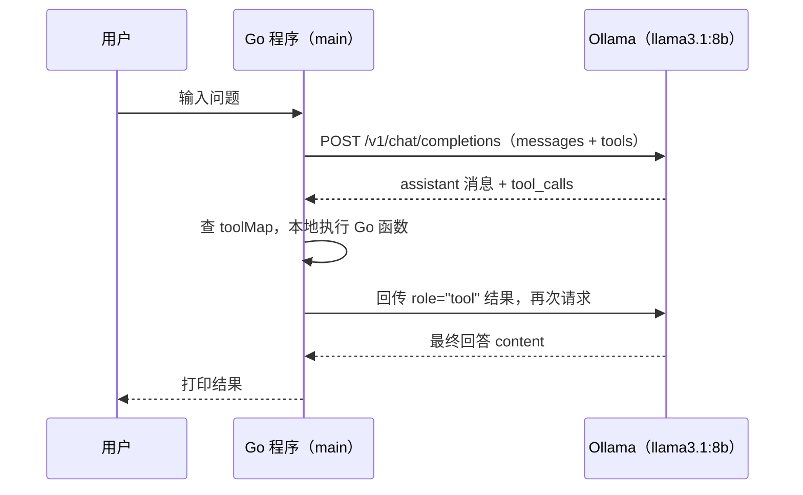

本系列主线是“用最小案例讲透一个原理，再逐步工程化”。本篇是**刻意精简的最小案例**：一个工具、单轮调用、约 200 行 Go（含注释），只用标准库（`net/http`、`encoding/json`），跑通“模型点名 → Go 执行 → 结果回传 → 模型作答”的完整闭环。

- 目标读者：有 Go 基础、第一次写 Agent 工具调用（前提：已按第 1 篇装好 Ollama 与 `llama3.1:8b`）
- 代码：`demo/minimal-agent/main.go`，仓库根目录执行 `go run ./demo/minimal-agent`
- 运行要求：Go 1.27+（仓库 go.mod 已声明 go 1.27.1）

本系列默认读者是 **Go 开发者**。Python 等其他语言的读者仍可读第 1 篇与各篇的机制、避坑内容——工具调用机制、聊天模板问题、API 兼容与运维概念都和语言无关。

> 环境说明：本文基于 **Ollama 0.33.3 + llama3.1:8b（A770/Vulkan，2026-09）** 实测；Ollama 迭代快，环境变量以 `ollama serve --help` 为准，`/v1` 兼容字段以[官方 OpenAI 兼容文档](https://docs.ollama.com/api/openai-compatibility)为准。

## 1. 接口基调：/v1 近似兼容（先知道再写代码）

> 急着先跑起来？可以直接跳到第 2 节，用 curl / Go 跑通一次对话后再回来读本节的兼容差异细节。

本篇代码走 `POST http://localhost:11434/v1/chat/completions`——它只是与 OpenAI SDK 语法最接近，官方定位是 **OpenAI 兼容层，而非逐字段等同**。下表差异用 Ollama 0.33.3 实测并对照官方兼容文档核对（差异点随版本漂移——连流式报文格式都是后来才对齐的）；代码篇与后续第 4 篇（服务化、迁移云端）都会用到它：

| 差异点                       | Ollama（0.33.3 实测）                                                                                                                                                                                                             | 官方 OpenAI                                                 |
| ---------------------------- | --------------------------------------------------------------------------------------------------------------------------------------------------------------------------------------------------------------------------------- | ----------------------------------------------------------- |
| `tool_choice` 参数           | 部分支持且不稳定（0.33.3 实测：`required` 可强制调用、`none` 不生效；官方兼容文档未列入支持字段，上游仍在完善：[#17921](https://github.com/ollama/ollama/issues/17921)、[#11171](https://github.com/ollama/ollama/issues/11171)） | 支持 `auto`/`required`/指定函数，强制调用场景常用           |
| 空 `tools: []`               | 返回 200，等同没传工具                                                                                                                                                                                                            | 通常报错或要求省略该字段（多个 SDK 专门写 workaround 规避） |
| 工具调用时 `message.content` | 空字符串 `""`                                                                                                                                                                                                                     | `null`                                                      |
| `finish_reason`              | 工具调用时为 `tool_calls`（本版本已与 OpenAI 一致）                                                                                                                                                                               | `tool_calls`                                                |
| `n` / `user` / `logit_bias`  | 不支持                                                                                                                                                                                                                            | 支持                                                        |
| 流式报文                     | 早期与 OpenAI 不一致（Ollama [PR #17485](https://github.com/ollama/ollama/pull/17485) 后才对齐 `choices[].delta`），旧版本仍有差异                                                                                                | `choices[].delta`                                           |

写代码时的三条铁律（本篇代码已经在遵守）：

- 判"是否要调工具"以 **`tool_calls` 非空 / `finish_reason == "tool_calls"`** 为准，不要只依赖 `content`；
- 判空时同时兼容 `content == ""` 与 `content == null`；
- 无工具时**省略 `tools` 字段**，不要传 `tools: []`；
- 需要"强制调用某工具"时别指望 `tool_choice`（0.33.3 实测 required 可强制、none 不生效，字段支持不稳定），改用提示词约束或原生 `/api/chat`（第 4 篇第 1 节会对比原生 `/api/chat` 的报文差异，但服务为了可切云端统一走 `/v1`）。

参考：[Ollama OpenAI compatibility 官方文档](https://docs.ollama.com/api/openai-compatibility)

---

## 2. 纯文本起步：核心逻辑约 20 行跑通一次对话

先用 curl 徒手跑通一次——与语言无关，也最容易确认服务与模型就绪：

```bash
curl -s http://localhost:11434/v1/chat/completions \
  -H "Content-Type: application/json" \
  -d '{"model":"llama3.1:8b","messages":[{"role":"user","content":"你好，用一句话介绍你自己。"}]}'
```

返回的 JSON 长这样（格式化后）：

```json
{
  "id": "chatcmpl-9",
  "model": "llama3.1:8b",
  "choices": [{                   // ← Go: ChatResponse.Choices[]
    "message": {                   // ← Go: ChatResponse.Choices[].Message
      "role": "assistant",
      "content": "我是语言模型，能理解和生成汉语。"  // ← 你要的答案
    },
    "finish_reason": "stop"        // ← 模型收工了（工具调用时会变成 "tool_calls"，见 §3）
  }],
  "usage": {                       // ← token 计数，第 3 篇"历史全量重发"的成本来源
    "prompt_tokens": 19,
    "completion_tokens": 13
  }
}
```

你只需关心 `choices[0].message.content`——这就是答案。后面的 Go 代码就照着这个 JSON 结构定义结构体。

在给代码"加工具"之前，先想清楚一个问题：**什么时候其实不需要 Agent？** 简单问答/闲聊直接用 `/api/chat`（不带 `tools`）即可；纯文本补全用 `/api/generate` 更轻（无聊天模板与工具解析开销）；确定性任务（查表、格式化）甚至不用模型。只有任务需要**真实世界的副作用或数据**（查时间、查库、执行命令）且执行路径无法预先写死时，才值得上"模型点名 → 代码执行 → 结果回传"的回路——第 3 篇会说明每轮要全量重发历史，这个判断越早做越省 token。

而**纯文本聊天正是这条轻量路径的最简形态**：同样把 `messages` 数组发到 `/v1/chat/completions`，只是请求里没有 `tools` 字段、响应里也只有 `content` 没有 `tool_calls`。

完整代码（`demo/plain-chat/main.go`，约 60 行、只有标准库）：

<details>
<summary>demo/plain-chat/main.go 全文（点击展开）</summary>

```go
// 第 2 篇（纯文本起步版）演示：核心逻辑约 20 行跑通一次对话
//
// 与工具版的关系：纯文本聊天是工具调用的"子集"——同一个
// /v1/chat/completions 接口、同样的 messages 数组，只是：
//  1. 请求里不带 tools 字段（遵守"无工具时省略 tools"铁律）；
//  2. 响应里只有 content，没有 tool_calls；
//  3. 多轮对话 = 不断往 messages 里追加 {role,content}，再整段重发。
package main

import (
	"bytes"
	"encoding/json"
	"fmt"
	"io"
	"net/http"
)

type Message struct {
	Role    string `json:"role"`
	Content string `json:"content"`
}

type ChatRequest struct {
	Model       string    `json:"model"`
	Messages    []Message `json:"messages"`
	Temperature float64   `json:"temperature"`
}

type Choice struct {
	Message      Message `json:"message"`
	FinishReason string  `json:"finish_reason"`
}

type ChatResponse struct {
	Choices []Choice `json:"choices"`
}

func main() {
	messages := []Message{
		{Role: "user", Content: "你好，请用一句话介绍你自己。"},
	}

	reqBody := ChatRequest{
		Model:       "llama3.1:8b",
		Messages:    messages,
		Temperature: 0, // 演示用贪心解码，输出稳定可复现
	}
	jsonData, _ := json.Marshal(reqBody)

	resp, err := http.Post("http://localhost:11434/v1/chat/completions",
		"application/json", bytes.NewBuffer(jsonData))
	if err != nil {
		panic(err)
	}
	defer resp.Body.Close()

	body, _ := io.ReadAll(resp.Body)
	var result ChatResponse
	if err := json.Unmarshal(body, &result); err != nil {
		fmt.Printf("解析失败，原始响应: %s\n", string(body))
		panic(err)
	}
	if len(result.Choices) == 0 {
		fmt.Printf("无响应，原始响应: %s\n", string(body))
		return
	}

	c := result.Choices[0]
	fmt.Println("🧑 用户:", messages[0].Content)
	fmt.Println("🤖", c.Message.Content)
	fmt.Println("   finish_reason:", c.FinishReason)
}
```

</details>

三个要点：

- 请求体只有 `model` + `messages`，没有 `tools`——这正是第 1 节铁律"无工具时省略 `tools` 字段"的落地；
- 响应读 `choices[0].message.content` 与 `finish_reason`（这里是 `stop`）；
- **多轮对话 = 往 `messages` 里追加再整段重发**，这是后面所有 demo 的公共基础。

运行：

```bash
go run ./demo/plain-chat
```

真实输出（Ollama 0.33.3 + llama3.1:8b，2026-09 实测）：

```
🧑 用户: 你好，请用一句话介绍你自己。
🤖 你好！我是 LLaMA，一个由 Meta 开发的基于人工智能的语言模型，能够理解和生成人类语言。
   finish_reason: stop
```

> 从这一节到下一节只差"三件事"：请求加 `tools` 字段、响应解析 `tool_calls`、执行结果用 `role="tool"` 回传。工具版的结构体与 `sendRequest` 和本节几乎一模一样——所以教程直接从工具讲起也成立，但先看纯文本更容易建立直觉。

---

## 3. Go 实现（在纯文本上加工具）

这是**刻意精简的最小案例**：一个工具、单轮调用、约 200 行（含注释），只用 Go 标准库（`net/http`、`encoding/json`）。

设计取舍如下，先看懂原理，再补工程化：

| 刻意简化的地方                                            | 生产环境的做法                                                |
| --------------------------------------------------------- | ------------------------------------------------------------- |
| 只支持单个工具、单轮调用                                  | 多工具注册 + while 循环，直到模型不再请求工具                 |
| HTTP 错误直接 `panic`                                     | 返回 `error` 并优雅降级/重试                                  |
| `json.Marshal`、`io.ReadAll` 错误忽略                     | 逐一处理并带上上下文                                          |
| 硬编码模型名 `llama3.1:8b`                                | 配置化（flag / 环境变量）                                     |
| 固定 30s 超时、无并发控制                                            | `http.Client` 超时 + 连接池                                   |
| 只读 `message.content`/`tool_calls`，不判 `finish_reason` | 按本篇第 1 节兼容差异清单处理（`tool_choice`、空 `tools` 等） |

### 完整代码（main.go）

先看请求和响应的原始 JSON——**代码里的结构体就是照着这两个 JSON 定义的**：

请求（带 `tools` 数组）：

```json
{
  "model": "llama3.1:8b",
  "messages": [{"role": "user", "content": "现在几点了？"}],
  "tools": [{                             // ← Go: ChatRequest.Tools []Tool
    "type": "function",
    "function": {
      "name": "get_current_time",
      "description": "获取当前时间",
      "parameters": {"type": "object", "properties": {}}
    }
  }]
}
```

响应（Ollama 0.33.3 实测）：

```json
{
  "choices": [{
    "message": {                           // ← Go: ChatResponse.Choices[].Message
      "role": "assistant",
      "content": "",                       // ⚠️ 空字符串，不是 null
      "tool_calls": [{                     // ← Go: Message.ToolCalls []ToolCall
        "id": "call_dlj5358x",             // ⚠️ 关联 ID：执行结果回传时必须带上这个
        "function": {
          "name": "get_current_time",
          "arguments": "{}"                // ⚠️ 这是字符串！不是对象！需要 json.RawMessage 再解析
        }
      }]
    },
    "finish_reason": "tool_calls"          // ⚠️ 不是 "stop"（第 3 篇循环判据）
  }],
  "usage": {"prompt_tokens": 146, "completion_tokens": 14}
}
```

看完这两段 JSON，再看后面的 Go 代码：`ToolCall.Function.Arguments` 为什么要用 `json.RawMessage` 再解析一次、`ToolCallID` 是干什么用的，就一目了然了。

<details>
<summary>demo/minimal-agent/main.go 全文（点击展开）</summary>

```go
package main

import (
	"bytes"
	"encoding/json"
	"fmt"
	"io"
	"net/http"
	"time"
)

// ===========================================
// 数据结构定义（对应 Ollama API 的 JSON 格式）
// ===========================================

// Message 表示对话中的一条消息
type Message struct {
	Role       string     `json:"role"`
	Content    string     `json:"content,omitempty"`
	ToolCalls  []ToolCall `json:"tool_calls,omitempty"`
	ToolCallID string     `json:"tool_call_id,omitempty"`
}

// ToolCall 表示 AI 请求调用的一个工具
type ToolCall struct {
	ID       string `json:"id"`
	Type     string `json:"type"`
	Function struct {
		Name      string `json:"name"`
		Arguments string `json:"arguments"`
	} `json:"function"`
}

// Tool 表示我们提供给 AI 的一个可用工具
type Tool struct {
	Type     string   `json:"type"`
	Function Function `json:"function"`
}

// Function 表示工具函数的定义
type Function struct {
	Name        string                 `json:"name"`
	Description string                 `json:"description"`
	Parameters  map[string]interface{} `json:"parameters"`
}

// ChatRequest 表示发送给 Ollama 的请求
type ChatRequest struct {
	Model    string    `json:"model"`
	Messages []Message `json:"messages"`
	Tools    []Tool    `json:"tools"`
	Stream   bool      `json:"stream"`
}

// Choice 表示一次生成的选择（含完成原因）
type Choice struct {
	Message      Message `json:"message"`
	FinishReason string  `json:"finish_reason"`
}

// ChatResponse 表示 Ollama 返回的响应
type ChatResponse struct {
	Choices []Choice `json:"choices"`
}

// ===========================================
// 工具函数（实际执行的逻辑）
// ===========================================

// getCurrentTime 是我们实现的工具函数
// 当 AI 决定调用 "get_current_time" 时，这个函数会被执行
// args 是 AI 传入的参数（本例中没有参数，所以忽略）
func getCurrentTime(args json.RawMessage) string {
	return time.Now().Format("2006-01-02 15:04:05")
}

// toolMap 是工具注册表，用于根据名称查找对应的函数
// 当 AI 返回 tool_calls 时，我们通过这个表找到要执行的函数
var toolMap = map[string]func(json.RawMessage) string{
	"get_current_time": getCurrentTime,
}

// ===========================================
// 主程序（演示 Tool Calling 的完整流程）
// ===========================================

func main() {
	// 第一步：准备用户消息
	// 这是用户问 AI 的问题
	messages := []Message{
		{Role: "user", Content: "现在几点了？告诉我当前的具体时间。"},
	}

	// 第二步：定义可用工具
	// 告诉 AI 有哪些工具可以使用，以及每个工具的功能和参数
	tools := []Tool{
		{
			Type: "function",
			Function: Function{
				Name:        "get_current_time",
				Description: "获取当前的日期和时间",
				Parameters: map[string]interface{}{
					"type":       "object",
					"properties": map[string]interface{}{},
				},
			},
		},
	}

	// 第三步：发送请求给 Ollama
	// 把用户消息和工具列表一起发给模型
	resp := sendRequest(messages, tools)
	if len(resp.Choices) == 0 {
		fmt.Println("无响应")
		return
	}

	// 获取 AI 的回复
	assistantMsg := resp.Choices[0].Message
	messages = append(messages, assistantMsg)

	// 第四步：检查 AI 是否要调用工具
	if len(assistantMsg.ToolCalls) > 0 {
		// AI 决定调用工具
		toolCall := assistantMsg.ToolCalls[0]
		fmt.Println("🔧 模型决定调用工具:", toolCall.Function.Name)

		// 第五步：执行工具
		// 通过工具注册表找到对应的函数并执行（查不到多半是模型幻觉了工具名，别 panic）
		fn, ok := toolMap[toolCall.Function.Name]
		if !ok {
			fmt.Println("⚠️ 未知工具，跳过:", toolCall.Function.Name)
			return
		}
		result := fn(json.RawMessage(toolCall.Function.Arguments))

		// 第六步：把工具结果作为新消息加入对话
		// 注意：Role 必须是 "tool"，ToolCallID 必须与 AI 请求的 ID 一致
		messages = append(messages, Message{
			Role:       "tool",
			ToolCallID: toolCall.ID,
			Content:    result,
		})

		fmt.Println("✅ 工具结果:", result)

		// 第七步：把包含工具结果的对话再次发给模型
		// 模型会根据工具结果生成最终回答
		finalResp := sendRequest(messages, tools)
		if len(finalResp.Choices) > 0 {
			fmt.Println("💬 最终回答:", finalResp.Choices[0].Message.Content)
		}
	} else {
		// AI 没有调用工具，直接输出回答
		fmt.Println("💬 回答:", assistantMsg.Content)
	}
}

// ===========================================
// HTTP 请求函数（与 Ollama 通信）
// ===========================================

// sendRequest 发送请求到 Ollama API
// 使用 OpenAI 兼容的格式：/v1/chat/completions
func sendRequest(messages []Message, tools []Tool) ChatResponse {
	// 构建请求体
	reqBody := ChatRequest{
		Model:    "llama3.1:8b", // 使用的模型
		Messages: messages,      // 对话历史
		Tools:    tools,         // 可用工具
		Stream:   false,         // 不使用流式输出
	}

	// 序列化为 JSON
	jsonData, _ := json.Marshal(reqBody)

	// 发送 POST 请求到 Ollama（用带超时的 Client 替代裸 http.Post，避免上游卡住时无限挂起）
	client := &http.Client{Timeout: 30 * time.Second}
	resp, err := client.Post(
		"http://localhost:11434/v1/chat/completions",
		"application/json",
		bytes.NewBuffer(jsonData),
	)
	if err != nil {
		panic(err)
	}
	defer resp.Body.Close()

	// 读取响应
	body, _ := io.ReadAll(resp.Body)

	// 解析 JSON 响应
	// 注意：Ollama 报错时返回的不是标准结构，直接解析会得到空响应，
	// 静默输出"无响应"会让新手误以为模型没装好，因此失败时打印原始内容
	var result ChatResponse
	if err := json.Unmarshal(body, &result); err != nil {
		fmt.Printf("解析失败，原始响应: %s\n", string(body))
		panic(err)
	}
	return result
}
```

</details>

### 代码讲解

代码由三部分组成，理解它们的职责即可：

#### 1. 数据结构（文件前半段）

`Message`、`ToolCall`、`Tool` 等结构体与 Ollama API 的 JSON 字段一一对应（靠 `json:"..."` 标签）。其中最容易困惑的是 `Message`：

- `role="assistant"` 的消息里带 `tool_calls`（AI 想调什么工具）
- `role="tool"` 的消息里带 `tool_call_id`（工具执行结果，回传给 AI）

#### 2. 工具定义与注册表

```go
// 工具实现：模型调用 "get_current_time" 时执行这里
func getCurrentTime(args json.RawMessage) string {
	return time.Now().Format("2006-01-02 15:04:05")
}

// 注册表：模型只发工具"名字"，程序靠这张表找到对应的 Go 函数
var toolMap = map[string]func(json.RawMessage) string{
	"get_current_time": getCurrentTime,
}
```

#### 3. 主流程 `main()`（对应下方时序图）

`main()` 内注释按「第一步 ~ 第七步」执行，与下方时序图一一对应：



> 博客未启用 Mermaid 时，流程即：用户 → 带 tools 请求 → 收到 tool_calls → 本地执行工具 → 结果以 role="tool" 回传 → 拿到最终回答（对应下方步骤表）。

| 步骤   | 做什么                                                          |
| ------ | --------------------------------------------------------------- |
| 第一步 | 准备用户消息（`role="user"`）                                   |
| 第二步 | 定义可用工具列表（告诉模型"有这个工具"）                        |
| 第三步 | 调 `sendRequest` 发给模型                                       |
| 第四步 | 判断返回的 `assistant` 消息是否带 `tool_calls`                  |
| 第五步 | 按工具名查 `toolMap`，执行对应的 Go 函数                        |
| 第六步 | 把结果包装成 `role="tool"` 消息，`ToolCallID` 对齐模型的调用 ID |
| 第七步 | 再次 `sendRequest`，模型基于真实结果生成最终回答                |

> 关键点：第六步的 `ToolCallID` 必须与模型请求里的 `ID` 一致，模型才能把结果对应到那一次调用。整套机制的核心是——**模型不执行工具，只"点名"；执行永远发生在本地代码**。

### HTTP 请求函数 sendRequest

全程序唯一与 Ollama 通信的地方：

- 请求体里 `Model` 指定模型名、`Messages` 带完整对话历史、`Tools` 带工具清单
- 请求发到 OpenAI 兼容接口 `POST http://localhost:11434/v1/chat/completions`
- 响应解析后返回 `ChatResponse`，`main()` 从 `Choices[0].Message` 取 AI 回复

### 生产化起步：四个小改造（从 200 行到工程的过渡态）

上面表格只给了方向，这里直接给最小的改造示例；更完整的演进在 demo 目录里按第 3、4 篇逐步展开。

**① 固定 30s 超时 → 可配置超时预算**

最小版已经用带 30s 超时的 `http.Client` 发请求（见上方完整代码里的 `sendRequest`），这一步是把超时改成可按场景调整的预算：

```go
// 改造前（最小版：固定 30 秒）
client := &http.Client{Timeout: 30 * time.Second}

// 改造后（长上下文 / 云端慢推理要留足余量）
client := &http.Client{Timeout: 5 * time.Minute}
```

> 重点不是数值，而是给上游请求一个**明确的超时预算**：没有它，Ollama 卡住时请求会无限挂起。

**② `panic` → 返回 `error`**

```go
// 改造前
func sendRequest(...) ChatResponse { ...; panic(err) }

// 改造后
func sendRequest(...) (ChatResponse, error) { ...; return ChatResponse{}, fmt.Errorf("请求失败: %w", err) }
```

主流程随之从"崩掉"变成"打日志并优雅降级"。

**③ 硬编码模型名 → 环境变量**

```go
model := os.Getenv("OLLAMA_MODEL")
if model == "" {
    model = "llama3.1:8b"
}
```

**④ 单轮 → 循环（下一步就是第 3 篇）**

把"收到 `tool_calls` → 执行 → 回传"包进 `for`，直到响应里不再有 `tool_calls` 才收尾——这就是第 3 篇的主题；多工具注册、参数解析、错误回喂也都在那里补上。

> 小结：上面四点 + 第 3 篇的循环/多工具/错误处理 + 第 4 篇的服务化/超时/并发，合起来就是"刻意简化 vs 生产做法"右列的落地路径——每篇只往前走一小步，不必一步到位写"生产级"。

---

## 4. 运行结果

```bash
go run ./demo/minimal-agent
```

成功输出：

```
🔧 模型决定调用工具: get_current_time
✅ 工具结果: 2026-09-07 19:58:44
💬 最终回答: 当前时间是 2026年09月07日 19:58:44
```

Agent 真的执行了我的 Go 函数，拿到真实时间，而不是编一个答案。

### 对比：同一个程序换回 qwen2.5-coder 的输出

同一个程序换回 `qwen2.5-coder:7b`（官方模板已带工具格式，模型仍未遵守），模型把工具调用写成了普通文本：

```
💬 回答: {"name": "get_current_time", "arguments": {}}
```

它"知道"该调工具，却没写进 `tool_calls` 字段——qwen2.5-coder + Ollama 0.33.3 的稳定复现（原因与自查见第 1 篇附录 A）。看到这种输出，先检查模型与模板，而不是怀疑自己的代码。

---

## FAQ：常见问题速查（代码篇）

| 问题                                | 原因                                                                               | 解决                                                                |
| ----------------------------------- | ---------------------------------------------------------------------------------- | ------------------------------------------------------------------- |
| 代码报 404 / 400                    | Ollama 版本过旧，`/v1/chat/completions` 接口未开启                                 | 升级到 >= 0.3.0（见第 1 篇安装）                                    |
| 模型回答里出现 `{"name": ...}` 字样 | 模板未带工具格式，或模型遵循度不足（qwen2.5-coder 在 0.33.3 下官方模板正确仍复现） | 换 `llama3.1:8b`；留用 Qwen 的实录与自查见第 1 篇附录 A             |
| 切到 OpenAI / 云服务后行为不一致    | `/v1` 只是近似兼容，字段细节有差异                                                 | 按本篇第 1 节清单自测（空 `tools`、content 空串、`tool_choice` 等） |

---

## 结论

1. **Go 做 Agent 可行**：不碰 Python，约 200 行标准库代码跑通完整工具调用闭环；
2. **这是最小案例**：只覆盖核心原理（单工具、单轮调用），多工具/多轮循环是第 3 篇的主题；
3. **/v1 是近似兼容**：本篇代码的判定方式（`tool_calls` 非空 + 省略空 `tools`）保证在 Ollama 与 OpenAI 上行为一致；
4. **Qwen 的坑要按型号区分**：qwen2.5-coder 是模型遵循度问题（官方模板已正确仍失败），不是"Qwen 都不行"——实录见第 1 篇附录 A。

下一篇预告：**《循环：让 Agent 自己决定调几次工具》**——多工具注册、参数解析、工具报错回喂与历史裁剪。
