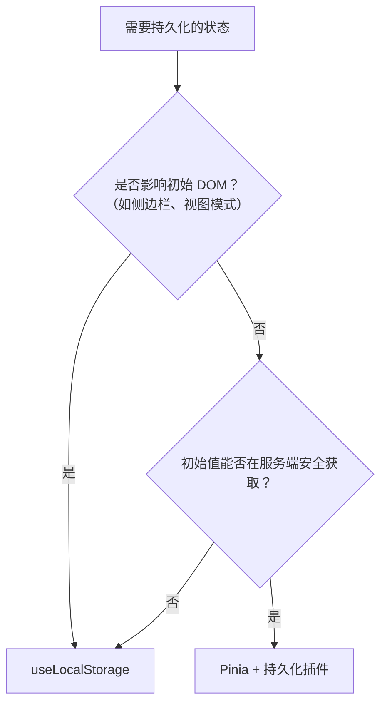

## 📚 系列导航

本系列共三篇，覆盖 Nuxt 性能优化相关实践：

1. [**Nuxt Content 渲染问题解决指南**](./nuxt-content-config-guide) —— @nuxt/content 配置与渲染
2. [**Nuxt 图片引用：\<NuxtImg\> 实践**](./nuxt-image-best-practice) —— 图片优化与路径问题
3. [**Nuxt 4 状态持久化**](./nuxt-state-persistence-guide) —— SSR 水合失败根治

---

> ## 前言
>
> 我打算给博客加“视图模式”切换——让读者在“详细模式”（显示摘要）和“简洁模式”（只显示标题）间切换。功能很简单：用 `USelect` 绑定 Pinia 的 `viewMode`，再用 `v-if` 控制摘要显示。
>
> 本地开发一切正常。部署后却出现诡异现象：刷新页面时下拉菜单总是跳回“详细模式”，控制台报了一堆 `Hydration mismatch` 错误。我用过 `ClientOnly`，虽然不报错了，但刷新时出现短暂空白。我试过在 `onMounted` 里延迟读取，试过 `isHydrated` 标志，代码越来越复杂，bug 却还在。
>
> 直到我重新理解了 Nuxt 的 SSR 机制和 `useLocalStorage` 的原理，才真正解决了问题。

## 问题根源：两个世界的状态冲突

Nuxt 的 SSR 流程：

1. **服务端**：在 Node.js 环境生成 HTML，无法访问 `localStorage`
2. **客户端**：在浏览器激活页面，可以正常访问所有 Web API

**水合失败**发生在：服务端用一个状态（如 `viewMode = 1`）渲染 HTML，客户端用另一个状态（如从 `localStorage` 读出的 `viewMode = 2`）激活，两边不一致，Vue 报错。

```ts
// 错误示例：直接在组件顶层读取 localStorage
const viewMode = ref(localStorage.getItem("viewMode") === "2" ? 2 : 1);
// 服务端报错，客户端值不一致 → 水合失败
```

## 两类状态，两种处理方式

### 1. 配置型状态（SSR 安全）

- 主题、语言、搜索选项等
- 初始值来自 SSR 安全 API（`useColorMode`、`useI18n`）或固定默认值
- **可用 Pinia + 持久化插件**

```ts
export const useSettingsStore = defineStore(
  "settings",
  () => {
    const colorMode = useColorMode(); // SSR 安全
    const { locale } = useI18n(); // SSR 安全

    const preferences = ref({
      theme: colorMode.preference,
      language: locale.value,
      searchOption: 1,
    });

    return { preferences };
  },
  { persist: true },
); // 插件只在客户端恢复状态
```

### 2. UI 状态（高风险）

- 侧边栏折叠、面板显示、视图模式等
- **直接影响初始 DOM 结构**
- **用 `useLocalStorage`，不要进 Pinia**

## 解决方案：useLocalStorage

```vue
<script setup>
import { useLocalStorage } from "@vueuse/core";
// 服务端返回默认值 1，客户端自动同步 localStorage
const viewMode = useLocalStorage("viewMode", 1);
</script>
<template>
  <USelect v-model="viewMode" :items="viewModeOptions" />
  <UBlogPost
    v-for="post in posts"
    :description="viewMode === 1 ? post.description : ''"
  />
</template>
```

**为什么能解决？**

`useLocalStorage` 的核心是 **依赖注入 + 可选链**：

```ts
// 简化版原理
function useLocalStorage(key, initialValue) {
  // 关键：window?.localStorage 在服务端是 undefined
  const storage = import.meta.client ? localStorage : null;
  return useStorage(key, initialValue, storage);
}
```

- **服务端**：`storage = null`，直接返回 `initialValue`，无副作用
- **客户端**：`storage = localStorage`，自动读取并同步持久化值

整个过程：

- 服务端用默认值 1 渲染 HTML（带摘要）
- 客户端激活时，`useLocalStorage` 读到 localStorage 中的 2，更新视图
- 水合已完成，不会报错，用户看到最终状态

## 和 Pinia 持久化的本质区别

| 维度     | Pinia 持久化                         | useLocalStorage             |
| -------- | ------------------------------------ | --------------------------- |
| 设计模式 | 硬编码调用 `localStorage`            | 依赖注入，环境感知          |
| SSR 行为 | 正确配置时安全，但初始值只能用默认值 | 检测到无 storage → 安全降级 |
| 适用场景 | 配置型状态                           | UI 状态                     |

**核心检验标准**：问自己“这个状态的初始值需要在服务端决定 DOM 结构吗？”

- 是 → `useLocalStorage`
- 否 → Pinia + 持久化插件（确保初始值 SSR 安全）

## 决策流程图



## 实战建议

1. **不要在 Pinia store 顶层读 `localStorage`**，store 初始值必须 SSR 安全。
2. **UI 状态优先用 `useLocalStorage`**，简单可靠，无需进 store。
3. **`ClientOnly` 不是万能药**，会导致服务端空白，仅用于纯交互组件。
4. **务必测试生产构建**：`pnpm build && pnpm preview`，水合问题常在构建后暴露。

## 我的最终代码

```vue
<script setup>
import { useLocalStorage } from "@vueuse/core";
const viewMode = useLocalStorage("viewMode", 1);
const viewModeOptions = [
  { id: 1, name: "详细模式" },
  { id: 2, name: "简洁模式" },
];
</script>
<template>
  <USelect v-model="viewMode" :items="viewModeOptions" />
  <UBlogPost
    v-for="post in posts"
    :description="viewMode === 1 ? post.description : ''"
  />
</template>
```

没有 Pinia，没有 `isHydrated`，没有 `ClientOnly`。代码简洁，SSR 安全，水合通过。

## 总结

根治水合失败的核心原则：**让服务端和客户端第一次渲染的结果保持一致**。

- UI 状态 → `useLocalStorage`
- 配置状态 → Pinia + 持久化插件（确保初始值 SSR 安全）

这不是技巧问题，而是对 SSR 架构的理解问题。选择正确的工具，代码自然简洁。

> 如果你的状态需要通过链接分享（如分页、搜索、视图模式），可以阅读我的另一篇文档[《Nuxt 中 URL 与状态双向绑定指南》](nuxt-url-state-guide)。
